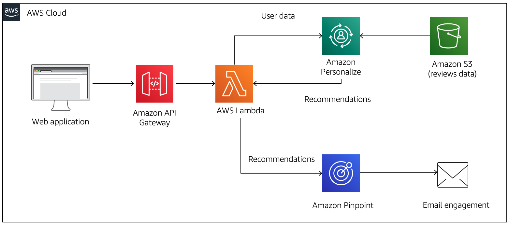
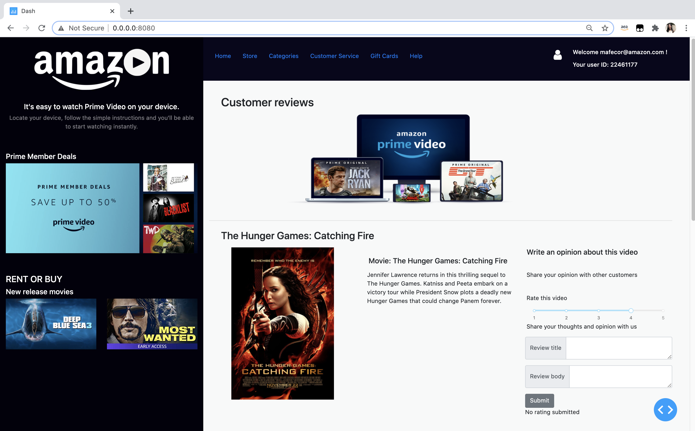
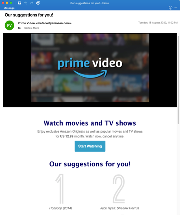

<h1>Deploy a full architecture for real-time recommendations using Amazon Personalize and Amazon Pinpoint</h1>

| Owner | Maria Cortes |
| ------ | ------ |
| Date| November, 2020 |

<h2>Objective</h2>

In this artifact we present an architecture for sending real-time recommendations on Amazon digital videos to users, and explain the procedure for deploying it. The proposed method connects several AWS products, in which Amazon Personalize is responsible for generating the recommendations, and Amazon Pinpoint for delivering them as email messages. As a data source for building the Amazon Personalize recommender system we used the customer reviews dataset available in the Registry of Open Data on AWS, where users rate their experiences regarding Amazon products. Specifically, we considered the reviews on the digital video product category, which comprises movies and TV shows.

<h2>Personalization architecture</h2>

This is the full architecture developed:



The entry-point is a web application where users can submit new reviews on TV shows or movies. This application is responsible for sending a POST HTTP request with the data regarding the new review to the API Gateway. The review data includes the following: user id, reviewed item, rating, e-mail address and time.

Subsequently, the API gateway sends the review data to a Lambda function, that in turn is responsible for sending it to a Personalize event tracker. The latter updates the user's interactions history to include the new review. Afterwards, the Lambda function retrieves the updated recommendations for the user from Personalize campaign, taking into account the newly submitted review. After retrieving the new recommendations, the Lambda function sends them to Amazon Pinpoint, which is responsible for immediately sending a customized email to the user with the recommendations content.

This artifact is organized as follows:
```
ml_checkride_resources/
├── readme.md
├── diagrams/          <- Diagrams of the resources and architecture
├── code/              <- Code for the Lambda function, SageMaker Jupyter notebooks and Pinpoint HTML template for email communications
├── Dash/              <- Code for creating the web application
├── requirements.txt   <- Libraries and versions used for the Dash web application
```    

The steps below outline the procedure for deploying the architecture.

<h2>Step 1. Setting up Amazon Pinpoint </h2>

<h3> Create an Amazon Pinpoint Project</h3>

In first place, we need to create a project in Amazon Pinpoint. This project will contain all the users that we will send messages to, as well as the recommendations associated to each one. Go to the Amazon Pinpoint console and create a new project. On the configuration, enable the email channel for the project you created. It is important to take note of the Pinpoint project ID.

For sending emails using Amazon Pinpoint, we must verify the identity address that will be used as a sender. We also need to verify the identities that you plan to send email to. This can be done in the Amazon Pinpoint console.

<h3>Create an Amazon Pinpoint Message Template</h3>

For sending a customized emails to users, we need to create an email template. In your Amazon Pinpoint project, add a new message template for the email channel, and include the `personalized-recommendations.html` code included in this artifact. This HTML template was created with Mailchimp tool (www.mailchimp.com). Amazon Pinpoint will use this template and replace the parameterized user attributes with the recommended items of each user. In this way, emails with personalized content and recommendations will be sent.

<h2>Step 2. Create a solution version and a campaign in Amazon Personalize</h2>

Now, we need to load the data into Amazon Personalize and create the recommender model as well as the Personalize campaign for retrieving recommendations. For doing so, this artifact contains the following notebooks that you must run in a SageMaker Notebook Instance:

- `code/1. EDA of videos data and dataset creation.ipynb`. This notebook includes the analysis of the videos dataset. You can find this dataset on the Registry of Open Data on AWS: https://s3.amazonaws.com/amazon-reviews-pds/readme.html. Specifically, you can download the digital videos dataset on: https://s3.amazonaws.com/amazon-reviews-pds/tsv/amazon_reviews_us_Digital_Video_Download_v1_00.tsv.gz.
- `code/2. Create dataset group and dataset in Personalize.ipynb`. This notebook creates the Amazon Personalize interactions dataset and resources for the Amazon videos recommendations.
- `code/3. Make Personalize solution versions for videos`. This notebook creates the Amazon Personalize solutions, solution versions, and campaigns using the Popularity-count, HRNN and HRNN-metadata recipes. It also shows how to perform HPO for HRNN and HRNN-metadata recipes.
- `code/4. Video real time predictions.ipynb`. In this notebook you will be able to exercise the HRNN-metadata HPO campaign created in the previous notebook, to make real-time predictions for users. We also create a Personalize event tracker for capturing real-time events.

Make sure that you replace the `account_num` parameter with your AWS account in all the notebooks. Moreover, it is important for you to configure the IAM role permissions of your SageMaker notebook instance for having Personalize, S3 and IAM access.

<h2>Step 3. Create the Lambda Function</h2>

We need to create a Lambda function that receives a new review from a user and sends it to the Personalize event tracker. Then, this lambda function will retrieve the new campaign recommendations for the user, taking into account the new review. Afterwards, the Lambda function sends the recommendations to the Amazon Pinpoint Project, that sends an immediate email to the user with the recommendations, using the previously created message template.

<h3>Lambda Function IAM role</h3>

Before creating the lambda function, you need to create a new IAM role with access to Personalize, Pinpoint and CloudWatch logs. For this, attach the policy included in the `code/lambda-personalize-policy.json` file included in this artifact.

<h3>Creating the Lambda Function</h3>

Go to the Lambda console and create a new function. Choose the Python 3.7 runtime and add the recently created role. Under the function code, paste the script `code/lambda-personalize-function.py` included in this artifact. Make sure to replace the following parameters:

- `REGION:` Replace with the name of the AWS Region that you want to use, such as us-east-1.
- `PROJECT-ID` Replace with the ID of the Amazon Pinpoint project that you created earlier.
- `CAMPAING-ARN`: Replace with the ARN of the Personalize hrnn-metadata-hpo campaign that you build in the previous step. You can find this value in the Amazon Personalize console.
- `TRACKER-NAME`: Replace with the name of the Personalize event tracker that you created in the SageMaker Jupyter notebooks. You can find this name in the Amazon Personalize console.

As mentioned before, the Lambda function receives information regarding a new review. We show an example of the input parameters expected by the function:

```json
{
  "user_id": "37197598",
  "item_id": "Lucy",
  "event_rating": 5,
  "event_verified_purchase": "Y",
  "event_type": "RATING",
  "email_address": "<ENTER YOUR EMAIL ADDRESS>"
}
```

<h2>Step 4. Create an API Gateway integrated with the Lambda function</h2>

Now, we need to create an API Gateway integrated with the previously created Lambda Function. Every time a POST HTTP request is made to the API Gateway, the latter will trigger the Lambda Function. For doing this, go to the API Gateway console and create a REST API. Create a resource within your REST API and create a POST method within. Leave the integration type set to Lambda Function, choose "Use Lambda Proxy integration" and choose your previously created Lambda function. It is important to choose OK when prompted with Add Permission to Lambda Function. For security, you can create an API KEY in the API Gateway console. Then, under the POST method you created before, choose Method Request and configure the Authorization Settings for requiring the created API Key. Then, deploy the API and take note of the API's Invoke URL.

<h2>Step 5. Create a Dash web application</h2>

As we aim to show how this technology could provide benefits to businesses, we built an example web application where a user can make new reviews of different videos. When a review is submitted in the application, the latter will send a POST HTTP request with the review data to the previously created API Gateway. We built the web application using Dash, a user interface open-source Python library for creating web-applications (see https://plotly.com/dash/). The source code is found in the `Dash` folder. For running this code, you need to install the dependencies:

```python
pip install -r requirements.txt
```

The file tree of the `Dash` folder is structured as follows:

```
App_Solutions
|   app.py
|   index.py
|   
+---assets
|   | amazon_styles.css
|   | badCountry.jpg
|   | catchingfire.jpg
|   | deepBlueSea.jpeg
|   | memberDeals.jpg
|   | mostWanted.jpg
|   | Option 3.png
|   | skyfall.jpg
|   | whiteLogo.png
|           
+---lib
|   |   movie1.py
|   |   movie1.py
|   |   movie3.py
|   |   sidebar.py
|   |   title.py  
```

The different parts of the layout of our app lie in the `lib` folder. For example, the `title.py` script contains the layout for the application's title bar. In this file, make sure to replace the following parameters:

- `USER_ID`: Replace with the user ID that you want to make recommendations for. The user ID is a string field.
- `EMAIL_ADDRESS`: Replace with the email address where you want to receive the recommendations. Remember that this email address must be verified in Pinpoint in order to be able to receive communications.

On the other hand, some basic styling and pictures lie in the `assets` folder. The app creation in Dash is done in the `app.py` script, and the callbacks and layout definition are located in the `index.py` file. In the latter script, make sure to replace the following parameters:

- `INVOKE_URL`: Replace with your API's Invoke URL.
- `API_KEY`: Replace with the API Key created previously.
- `USER_ID`: Replace with the user ID that you want to make recommendations for (string).
- `EMAIL_ADDRESS`: Replace with the email address where you want to receive the recommendations.

 From your terminal, you can run the `index.py` script:

```python
python index.py
```

Your terminal should output a code similar to this:
```python
Dash is running on http://0.0.0.0:8080/

 Warning: This is a development server. Do not use app.run_server
 in production, use a production WSGI server like gunicorn instead.

 * Serving Flask app "app" (lazy loading)
 * Environment: production
   WARNING: This is a development server. Do not use it in a production deployment.
   Use a production WSGI server instead.
 * Debug mode: on
```

Then, navigate to the address `http://0.0.0.0:8080/` (or the address shown in the output. There, you should be able to see the webpage, as shown in the following image:



When you press the `Submit` button to place a new review for any of the available videos, a POST HTTP request will be made to the API Gateway. The Lambda function will be triggered and Amazon Pinpoint will send the recommendations to the specified email, with the HTML template defined before:


